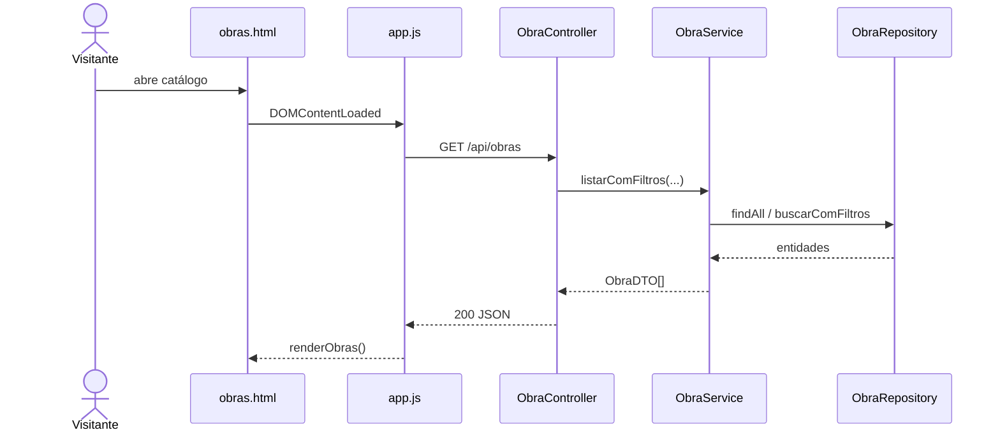

# Fluxos de dados

## Leitura de obras

Se a conexão falhar, `apiFetch` lança `NETWORK_OFFLINE`; o HTML de demonstração permanece na tela. Respostas HTTP 4xx/5xx não são tratadas como modo offline.

## Cadastro de usuário

1. Controller valida `UsuarioCreateDTO` com `@Valid`.
2. Service rejeita e-mail duplicado.
3. A senha é transformada por `BCrypt.hashpw`.
4. Repository persiste `Usuario`.
5. `UsuarioDTO` retorna apenas `id`, `nome`, `email` e `tipo`.

## Atualização de uma etapa

Ao criar ou editar uma etapa, `EtapaObraService` calcula a média do progresso de todas as etapas. A obra muda para `CONCLUIDA` em 100% ou `EM_ANDAMENTO` acima de 0%. A remoção também dispara o recálculo, desde que reste pelo menos uma etapa.

:::note
Quando a última etapa é removida, o serviço não redefine progresso ou status da obra. Considere esse comportamento ao evoluir a regra.
:::
