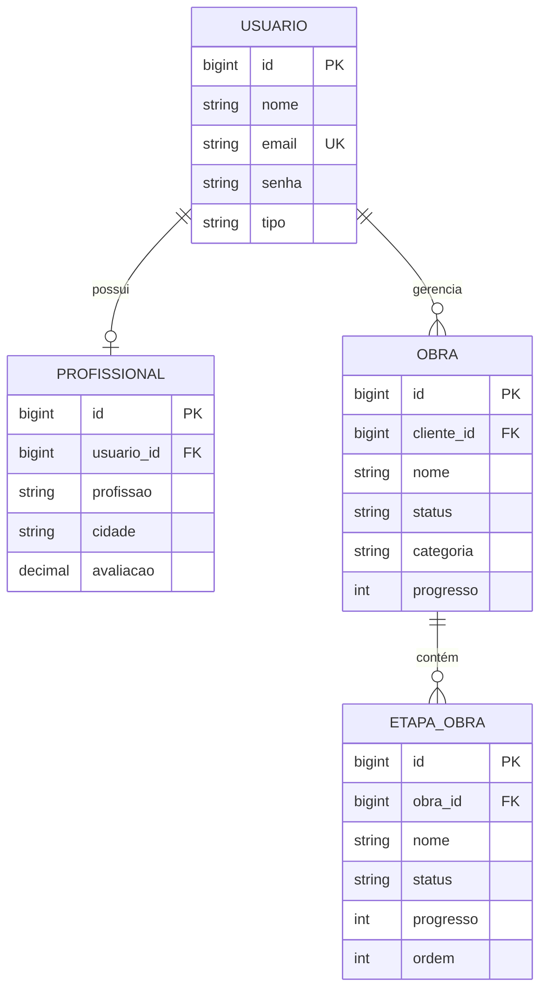

# Modelo de domínio

## Usuário

Identidade base. `email` é único e `tipo` assume `CLIENTE`, `PROFISSIONAL` ou `ADMIN`. A API nunca retorna `senha`.

## Profissional

Perfil um-para-um associado a usuário. Ao salvar o perfil, o serviço altera automaticamente o tipo do usuário para `PROFISSIONAL`. A consulta permite filtrar profissão, cidade, nome e especialidades.

## Obra

Pertence a um cliente e agrega etapas com cascade e remoção de órfãos. Estados esperados: `PLANEJAMENTO`, `EM_ANDAMENTO`, `CONCLUIDA`; categorias principais: `RESIDENCIAL`, `COMERCIAL`, `INFRAESTRUTURA`.

## Etapa de obra

Unidade ordenada do diário. Estados esperados: `PENDENTE`, `EM_ANDAMENTO`, `CONCLUIDO`. `progresso` varia de 0 a 100 no schema PostgreSQL.

:::caution Validação em duas camadas
Os valores de status e categoria aparecem como strings, não enums Java, e os DTOs de obra/etapa não declaram constraints. O PostgreSQL limita intervalos numéricos, mas H2 criado pelo JPA pode aceitar valores que os scripts SQL rejeitariam.
:::
