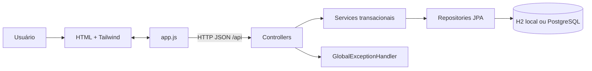

# Visão arquitetural

A solução usa uma arquitetura web em camadas. A apresentação é multipágina e progressivamente aprimorada por JavaScript; a API expõe JSON e isola o domínio por DTOs; JPA abstrai H2 e PostgreSQL.

## Responsabilidades

| Camada | Responsabilidade | Local |
|---|---|---|
| páginas | semântica, conteúdo inicial e acessibilidade | `frontend/*.html` |
| cliente | chamadas REST, renderização, filtros e fallback | `frontend/js/` |
| controllers | contrato HTTP e códigos de resposta | `backend/.../controller` |
| services | regras, transações e conversão de DTOs | `backend/.../service` |
| repositories | consultas e persistência | `backend/.../repository` |
| models | entidades e relacionamentos JPA | `backend/.../model` |
| dados | DDL, seed e políticas RLS | `database/` |

## Características importantes

- `spring.jpa.open-in-view=false`: relações lazy devem ser consumidas dentro de transações de serviço;
- DTOs impedem que senha e proxies JPA sejam serializados diretamente;
- `ddl-auto=update` facilita desenvolvimento, mas scripts SQL devem governar produção;
- as páginas existem em três cópias (raiz, `frontend/` e recursos estáticos do backend); alterações precisam ser sincronizadas;
- CORS permite consumo do backend por um servidor estático separado.

## Limites atuais

Não há autenticação de API, paginação, cache, migrations versionadas ou OpenAPI gerado. As políticas RLS se aplicam ao acesso via Supabase, enquanto o backend JDBC usa a credencial do banco e não propaga a identidade `auth.uid()`.
