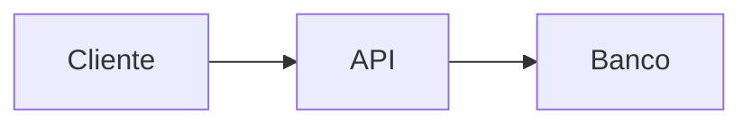

# Manter a documentação

O portal usa Docusaurus 3, Markdown/MDX e diagramas Mermaid. O conteúdo está em `website/docs`; navegação em `sidebars.js`; marca e plugins em `docusaurus.config.js`.

## Desenvolvimento

```bash
cd website
npm install
npm start
```

A busca local é gerada no build. Use `npm run build` para validar índice, links e renderização SSR.

## Nova página

Crie um `.md` com front matter:

```md
---
title: Minha página
description: Resumo útil para SEO e busca.
---

# Minha página
```

Depois, adicione o ID sem extensão em `sidebars.js`. Prefira links internos absolutos como `/docs/reference/api`.

## Padrões editoriais

- documente o comportamento real, separando claramente propostas futuras;
- use exemplos executáveis e sem credenciais;
- cite caminho, classe e endpoint de forma precisa;
- inclua alertas para riscos de segurança ou perda de dados;
- atualize API, schema e configuração na mesma PR do código;
- mantenha títulos e texto em português, preservando nomes técnicos.

## Diagramas

````md

````

Diagramas devem continuar legíveis no tema claro e escuro.
